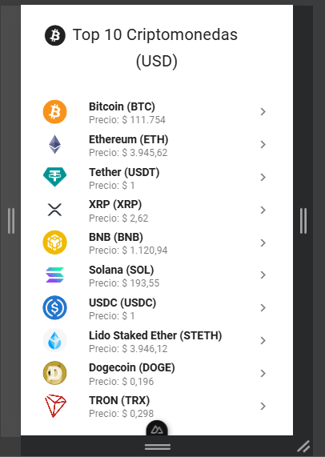

# Actividad: Frameworks y Librerías

## Aprendizaje esperado
Reconocer librerías y frameworks complementarios para ser incorporados en una aplicación Vue de acuerdo a las necesidades.

## Proyecto de referencia: `nuxt-coin-app`

Este proyecto fue desarrollado como parte de la actividad práctica para explorar el uso de Nuxt.js con Vue en una aplicación SSR.

### Descripción
`nuxt-coin-app` es una aplicación web construida con Nuxt 3 y Vue 3 que muestra los precios actuales de las principales criptomonedas en dólares estadounidenses (USD). Utiliza renderizado del lado del servidor (SSR) para mejorar el rendimiento y la indexación SEO.

### Tecnologías utilizadas
- **Nuxt 3**: Framework para Vue con soporte SSR y generación estática.
- **Vue 3**: Framework progresivo para construir interfaces de usuario.
- **Composición API**: Para una estructura más modular y mantenible.
- **Estilos personalizados**: CSS modular para diseño responsivo.//pendiente
- **Fetch API / Axios**: Para consumir datos de precios de criptomonedas.

### Características destacadas
- Renderizado SSR para mejorar el SEO y la velocidad de carga.
- Interfaz limpia y responsiva.
- Listado de las 10 criptomonedas principales con sus precios actualizados.
- Arquitectura modular y escalable.

### Captura de ejemplo en pantallas pequeñas

---

## Actividad 1: Exploración y comparación de librerías UI para Vue.js

### Objetivo
Reconocer y comparar distintas librerías de interfaces de usuario (UI) complementarias para Vue.js, eligiendo la más adecuada según los requisitos de una aplicación.

### 1. Investigación Teórica

#### BootstrapVue
- **Características**: Integración de Bootstrap 4 con Vue.js. Ofrece componentes como botones, formularios, modales, tooltips, etc.
- **Ventajas**:
  - Fácil de usar si ya se conoce Bootstrap.
  - Gran comunidad y documentación.
  - Compatible con proyectos que ya usan Bootstrap.
- **Desventajas**:
  - Menor personalización visual comparado con otras librerías.
  - Basado en Bootstrap 4 (no siempre actualizado a Bootstrap 5).
  - Puede generar sobrecarga de estilos si no se optimiza.

#### Vuetify
- **Características**: Basado en Material Design. Proporciona una amplia gama de componentes altamente personalizables.
- **Ventajas**:
  - Excelente diseño visual y coherencia.
  - Gran cantidad de componentes listos para usar.
  - Buen soporte para temas y personalización.
- **Desventajas**:
  - Curva de aprendizaje más alta.
  - Tamaño de bundle más grande.
  - Puede ser excesivo para proyectos pequeños.

#### Buefy
- **Características**: Basado en Bulma. Ofrece una interfaz limpia y ligera con componentes como botones, tarjetas, modales, etc.
- **Ventajas**:
  - Ligero y rápido.
  - Fácil de integrar y aprender.
  - Estética minimalista.
- **Desventajas**:
  - Menor cantidad de componentes que otras librerías.
  - Menos opciones de personalización avanzada.
  - Comunidad más pequeña.

#### Element UI
- **Características**: Framework UI con enfoque profesional. Incluye componentes como formularios, tablas, modales, etc.
- **Ventajas**:
  - Ideal para aplicaciones empresariales.
  - Componentes robustos y bien diseñados.
  - Buen soporte para internacionalización.
- **Desventajas**:
  - Documentación principalmente en inglés y chino.
  - Estilo visual menos moderno que Vuetify.
  - Puede requerir ajustes para adaptarse a diseños personalizados.

---

## Actividad 2: Exploración de frameworks para Server Side Rendering (SSR)

### Objetivo
Comprender qué es SSR, cuándo usarlo y sus ventajas/desventajas, utilizando Nuxt.js para crear una aplicación con renderizado en el servidor.

### 1. Investigación Teórica

#### ¿Qué es SSR?
SSR (Server Side Rendering) es una técnica donde el contenido HTML de una página se genera en el servidor antes de enviarse al navegador. Esto mejora el rendimiento inicial y la indexación por motores de búsqueda.

#### Ventajas de SSR
- Mejora el SEO al entregar contenido ya renderizado.
- Reduce el tiempo de carga inicial.
- Mejora la experiencia en dispositivos lentos.

#### Desventajas de SSR
- Mayor complejidad en la configuración.
- Requiere más recursos del servidor.
- Puede aumentar el tiempo de respuesta en interacciones dinámicas.

#### ¿Qué es Nuxt.js?
Nuxt.js es un framework basado en Vue.js que facilita la creación de aplicaciones SSR. Proporciona estructura, enrutamiento automático, generación de páginas estáticas y optimización para SEO.

#### ¿Qué es Quasar Framework?
Quasar es otro framework basado en Vue.js que permite crear aplicaciones SSR, PWA, móviles (con Cordova/Capacitor) y de escritorio (con Electron). Es ideal para proyectos multiplataforma.

---

## Recursos recomendados
- [Documentación oficial de Nuxt.js](https://nuxt.com/docs)
- [Documentación oficial de Quasar Framework](https://quasar.dev)
